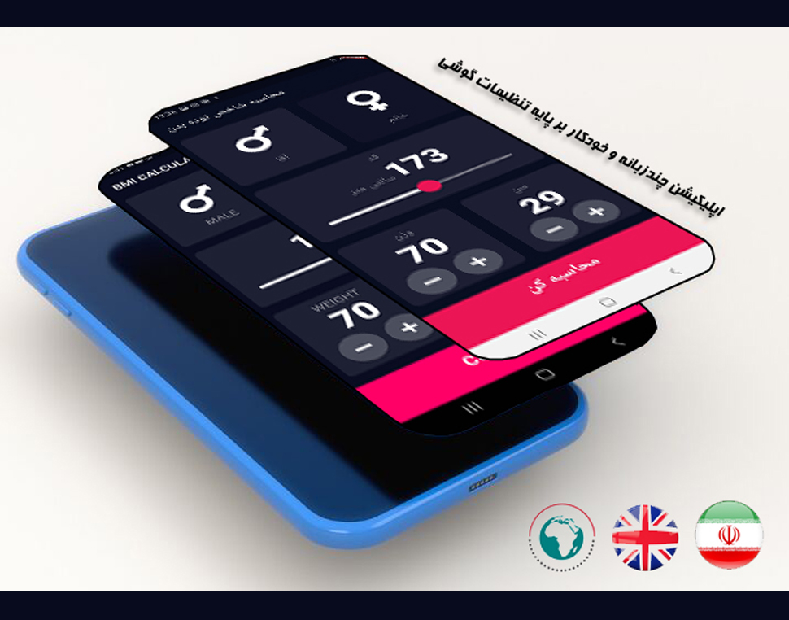

Some awsume mobile application samples
* All apps run on native code with fast performance
* Supports responsive layout
* Supports web, android, ios *platform* features aka *adaptive-design* 

# International application
This is Body Math Index calculator based on ui which I found on dribbble. It supports multiple languages and the ui widgets are customised to meet cutomer ui needs.

[BMI calculator repository](https://github.com/m8811163008/BMI-Calculator-with-pretty-ui)

# Feature driven design and Test-Driven-Development

# An insurance sample application RTL layout

# Using design patterns for optimization of mobile applications

# Stocks simulator with observer design pattern

Call +98921805230, your idea turns into mobile applications on any platform you choose.
