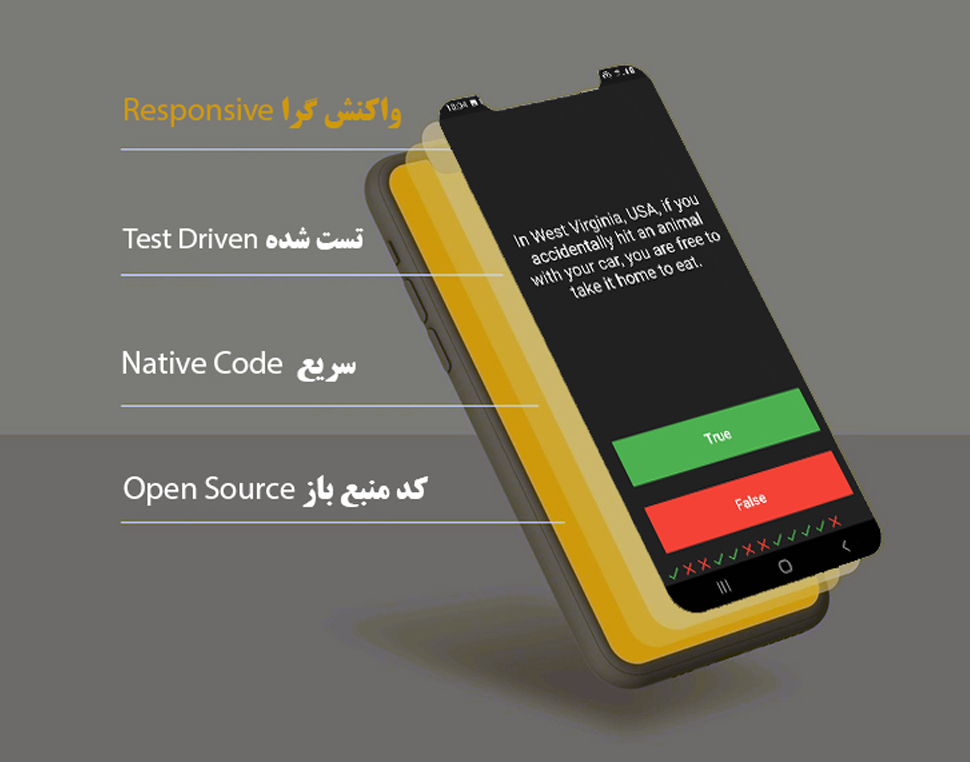
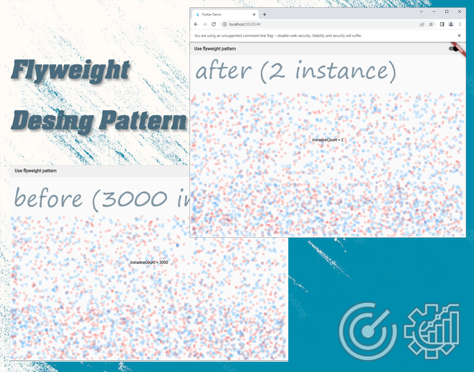

Some awsume mobile application samples
* All apps run on native code with fast performance
* Supports responsive layout
* Supports web, android, ios *platform* features aka *adaptive-design* 

# International application
This is Body Math Index calculator based on ui which I found on dribbble. It supports multiple languages and the ui widgets are customised to meet cutomer ui needs.

[BMI calculator repository](https://github.com/m8811163008/BMI-Calculator-with-pretty-ui)

# Feature driven design and Test-Driven-Development
At this project I used a design technique for programmers based on unit test first.I created unit test cases before developing the actual code.
And with Feature driven design which is an Agile methodology for developing software, Feature-Driven Development (FDD) is customer-centric, iterative, and incremental, with the goal of delivering tangible software results often and efficiently I managed to happify customer after delivering this project.

[Feature_driven_design_application](https://github.com/m8811163008/note_application)

# An insurance sample application RTL layout
An RTL layout is the mirror image of an LTR layout, and it affects layout, text, and graphics as I demonstrate in this project.
Factory Method design pattern defines an interface for a class responsible for creating an object, hence deferring the instantiation to specific classes implementing this interface. This resolves the issue of creating objects directly within the class which uses them. 

[RTL layout application](https://github.com/m8811163008/mediator_design_pattern)

# Using design patterns for optimization of mobile applications
A software design pattern is not about solving specific UI/UX problems (as it could look from first sight by noticing the word design), it is more about the code structure which is like a blueprint to solve a particular object-oriented design problem.
At this project I used sharing to support large numbers of fine-grained objects efficiently.
* Flyweight — contains an intrinsic state while the extrinsic state is passed to the flyweight’s methods. The object must be shareable (can be used in many different contexts);
* FlyweightFactory — creates and manages flyweight objects. When a client calls the factory, it checks whether the specific flyweight object exists. If yes, it is simply returned to the client, otherwise, a new instance of the flyweight object is created and then returned;
* Context — contains the extrinsic state, unique across all original objects;
* Client — computes or stores the extrinsic state of flyweight(s) and maintains a reference to it/them.
At this project I used the Flyweight design pattern because it should be used only when the program must support a huge number of objects which barely fit into available RAM.

[flyweight design pattern](https://github.com/m8811163008/flyweight_design_pattern)

# Stocks simulator with observer design pattern and a Socket IO project
I define a one-to-many dependency between objects so that when one object changes state, all its dependents are notified and updated automatically.
Why did I use this pattern? The motivation for this design pattern comes from the problem of having a collection of tightly coupled objects in the system where changes for one object should trigger changes in the others (one-to-many relationship). An inflexible way to implement this is to define an object that implements updating the state of other dependent ones. Such an object becomes hard to implement, maintain, test and reuse because of the dependency chaos.

[Stocks simulator project](https://github.com/m8811163008/observer_design_pattern)

# other proects
I tried to showcase some of not comercial projects which demonstrate my skills and knowledge and I did not show company projects which I worked with.
[Animate the properties of a container](https://github.com/m8811163008/Animate-the-properties-of-a-container)
[chain of responsibility design pattern](https://github.com/m8811163008/chain_of_responsibility_design_pattern)
[radix_sort](https://github.com/m8811163008/radix_sort)
[Stocks simulator project](https://github.com/m8811163008/observer_design_pattern)
[other projects](https://github.com/m8811163008?page=1&tab=repositories)
